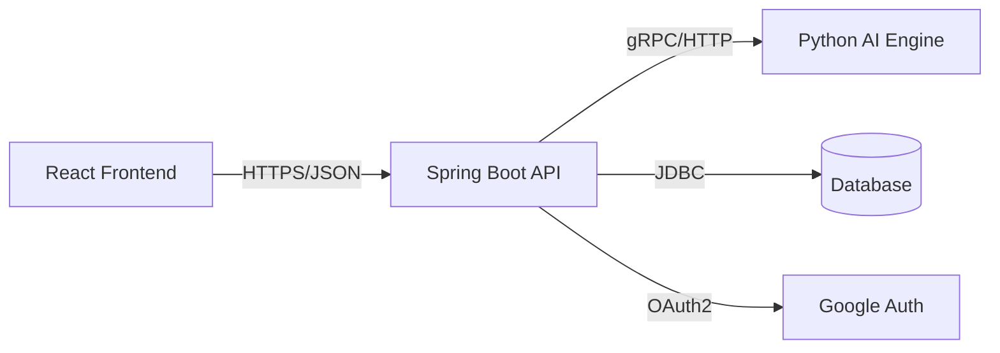

#  Alethiq - Neural Intelligence Engine


**Alethiq** is a next-generation AI chat platform capable of real-time streaming, complex query reasoning, and rich UI generation. It features a microservices architecture connecting a **React Frontend**, a **Java Spring Boot Backend**, and a **Python AI Engine**.

🚀 **Live Demo:** [https://alethiq.tech](https://alethiq.tech)

---

## 📑 Table of Contents
- [🌟 Key Features](#-key-features)
- [🏗️ Architecture](#-architecture)
- [🛠️ Tech Stack](#-tech-stack)
- [⚙️ Environment Variables](#-environment-variables)
- [🚀 Local Installation & Setup](#-local-installation--setup)
  - [1. AI Engine (Python)](#1-ai-engine-python)
  - [2. Backend (Java Spring Boot)](#2-backend-java-spring-boot)
  - [3. Frontend (React + Vite)](#3-frontend-react--vite)
- [☁️ Deployment](#-deployment)
- [🤝 Contributing](#-contributing)

---

## 🌟 Key Features

* ** Real-Time Streaming:** Instant AI responses using Server-Sent Events (SSE) and Reactive Streams (Project Reactor).
* ** Secure Authentication:** Google OAuth2 integration with JWT-based session management.
* ** Generative UI:** The AI can render rich widgets (Stat Cards, Charts) alongside text responses.
* ** Fully Responsive:** Mobile-first design with a collapsible sidebar and glassmorphism effects.
* ** Persistent Memory:** automatically saves chat history and threads per user.
* ** Markdown & Syntax Highlighting:** Full support for code blocks, tables, and formatted text.

---

## 🏗️ Architecture

Alethiq follows a **Microservices-style** architecture:

1.  **Frontend (Vercel):** React app that handles UI, Auth state, and SSE streaming.
2.  **Backend (Render):** Spring Boot API that acts as the orchestrator. It handles User Auth (OAuth2), manages Database (PostgreSQL/MySQL), and proxies requests to the AI engine.
3.  **AI Engine (Hugging Face):** A Python FastAPI service hosting the LLM inference logic.



---

## 🛠️ Tech Stack

### **Frontend**

* **Framework:** React 18 (Vite)
* **Styling:** Tailwind CSS, Framer Motion (Animations)
* **Icons:** Lucide React
* **State:** React Context API

### **Backend**

* **Core:** Java 17, Spring Boot 3
* **Security:** Spring Security, OAuth2 Client, JWT
* **Reactive:** Spring WebFlux (for streaming)
* **Database:** PostgreSQL / MySQL (JPA/Hibernate)

### **AI Engine**

* **Runtime:** Python 3.10
* **API:** FastAPI, Uvicorn
* **Libraries:** PyTorch, Transformers, LangChain (optional)

---

## ⚙️ Environment Variables

To run this project, you will need to configure the following `.env` files.

### **1. Backend (`application.properties` or `.env`)**

```properties
# Server Configuration
server.port=8080

# Database
spring.datasource.url=jdbc:postgresql://localhost:5432/alethiq_db
spring.datasource.username=your_db_user
spring.datasource.password=your_db_password

# Google OAuth2
spring.security.oauth2.client.registration.google.client-id=YOUR_GOOGLE_CLIENT_ID
spring.security.oauth2.client.registration.google.client-secret=YOUR_GOOGLE_CLIENT_SECRET
spring.security.oauth2.client.registration.google.redirect-uri={baseUrl}/login/oauth2/code/google

# JWT Secret
jwt.secret=YOUR_VERY_LONG_SECRET_KEY_HERE

# External Services
ai.service.url=http://localhost:8000  # Or your Hugging Face URL
app.frontend.url=http://localhost:5173 # Or [https://alethiq.tech](https://alethiq.tech)

```

### **2. Frontend (`.env`)**

```properties
VITE_API_URL=http://localhost:8080
# In production, use: [https://alethiq.onrender.com](https://alethiq.onrender.com)

```

---

## 🚀 Local Installation & Setup

### **Prerequisites**

* Node.js (v18+)
* Java JDK 17+
* Python 3.10+
* PostgreSQL or MySQL

### **1. AI Engine (Python)**

Navigate to the AI directory and install dependencies.

```bash
cd alethiq-ai
python -m venv venv
source venv/bin/activate  # Windows: venv\Scripts\activate
pip install -r requirements.txt
uvicorn main:app --reload --port 8000

```

### **2. Backend (Java Spring Boot)**

Configure your database in `application.properties`, then run the app.

```bash
cd alethiq-backend
./mvnw spring-boot:run

```

*The backend runs on `http://localhost:8080*`

### **3. Frontend (React + Vite)**

Install dependencies and start the dev server.

```bash
cd alethiq-frontend
npm install
npm run dev

```

*The frontend runs on `http://localhost:5173*`

---

## ☁️ Deployment

The system is deployed across three platforms to ensure scalability and free-tier compatibility.

| Component | Platform |
| --------- | -------- | 
| **Frontend** | **Vercel** 
| **Backend** | **Render** 
| **AI Engine** | **Hugging Face**


## 🤝 Contributing

Contributions are welcome! Please follow these steps:

1. Fork the repository.
2. Create a feature branch (`git checkout -b feature/Feature`).
3. Commit your changes (`git commit -m 'Add some Feature'`).
4. Push to the branch (`git push origin feature/Feature`).
5. Open a Pull Request.

---

## 📄 License

Distributed under the MIT License. See `LICENSE` for more information.

---

### **Authors**

* **Gaurav** - *Initial Work* - [@gaurav-code098](https://www.google.com/search?q=https://github.com/gaurav-code098)

```

```
